# Experiments for (Featured) Extended Team Automata

## Requirements 

- [sbt](https://www.scala-sbt.org/)

## Use

In the terminal, under the root folder team-a, run `sbt console`. 
Once the scala prompt appears, it works as an interpreter. 
First, import the classes/objects you want to use.
For now, the following is enough.
```bash
scala> import fta.Examples._ ; import fta.DSL._
```
The file `Examples` declares a few examples of (Featured) Component Automata,
(Featured) System, and (Featured) ETA. The file `DSL` has some quick commands to visualize
(Featured) System, and (Featured) ETA.
To use the examples just invoke the variable name of the example.

For example:
```bash 
scala> eta2
```
will show (in a not so nice way) the ETA from the 
"Compositionality of Safe Communication in Systems of Team Automata" paper, 
with two users and a server and the corresponding synchronisation type, while
```bash 
scala> sys2
```
will just show the system. 

To visualise the graph of the system or ETA, use the command `toMermaid` on either of them. 
For example: 

```bash
scala> toMermaid(eta1)
```
`eta1` is a smaller example with just one user and a server.

This will output an encoding into mermaid.js. 
You can use that code, and a live editor for Mermaid to view the graph 
[here](https://mermaid-js.github.io/mermaid-live-editor/) 

In this case, you should see the following: 



There are already some small examples with variability, 
including the running example from Maurice `feta1`.
These are just experiments so nothing is definitive yet.
There are two implementations of sync types with variability, 
right now it is set to use approach 1 from the appendix. 


```bash 
scala> toMermaid(feta1) 
```


In addition, it is possible to get some info from the various automata models, 
for example:

```bash
scala> feta1.fm       // feature model of the (featured) eta
scala> feta1.actions  // or .inputs, .outputs
sacal> feta1.products // set of valid feature selections
// same method apply to (featured) systems and (featured) component automata
```

## Adding examples

It is possible to define examples in the scala interpreter, 
but it will be easier to add more examples to the `Example` file, and then 
recompile with `sbt console`.


